jenkins conection b/w 2 nodes.
------------------------------ 
# steps

first we can create two instances with .pem(private key) key don't use import key.
```
next connect that instances in powershell
```
for jenkins we needd java so we can install java in 2 nodes
```
In jenkins master node
* sudo apt-get update
* sudo apt-get install openjdk-17-jdk -y
* curl -fsSL https://pkg.jenkins.io/debian-stable/jenkins.io.key | sudo tee \
  /usr/share/keyrings/jenkins-keyring.asc > /dev/null
* echo deb [signed-by=/usr/share/keyrings/jenkins-keyring.asc] \
  https://pkg.jenkins.io/debian-stable binary/ | sudo tee \
  /etc/apt/sources.list.d/jenkins.list > /dev/null
* sudo apt-get update
* sudo apt-get install  jenkins -y
```
after installing jenkins a user created jenkins /var/lib/jenkins


we can give user name and pass wd
then goto jenkins page click on install  suggsted pilugins  see the pages 

refer here [direct devops blog](https://directdevops.blog/2023/02/26/devops-classroomnotes-26-feb-2023/)

next in another node also install any java version mandatory


## using sonarqube in jenkins
--------------
* If this error came u can change instanse type micro to medium
  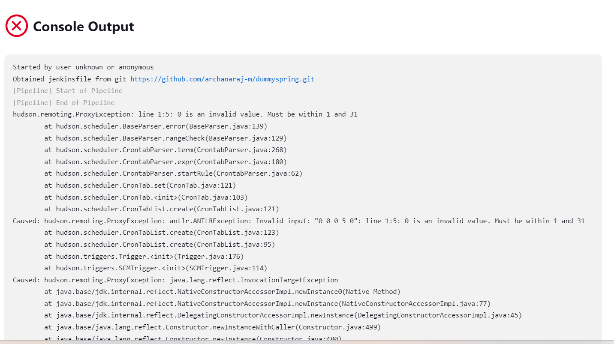
* for that first we can stop the instances then  select inastance and next goto Actions change instance type


### using Jforg in jenkins
* for that refer here[jenkins pipeline steps-artifactory](https://www.jenkins.io/doc/pipeline/steps/artifactory/#rtserver-creates-new-artifactory-server)
 * refer here[jfrog web page](https://landing.jfrog.com/register/trial-enterprise)
 * enter details host name -archanaraj123 ,company-qt next ok
 * sign in with git hub..once sign in one settings.xml and dependencies files are there in step2 and step3 copy that and paste in notepad(.xml file)
 * depoy the package for that copy the distribution management code and paste it in note pad next after the mvn clean package that code is paste in pom.xml in below the poject 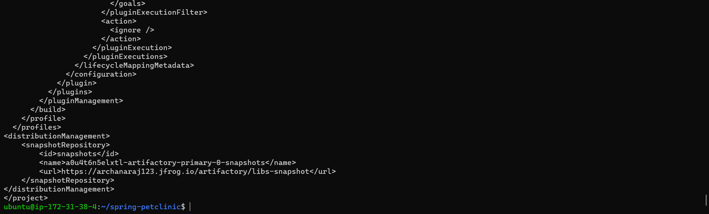
 * select maven because now we build maven project
 * next refer here[artifactory jenkins integration](https://www.jfrog.com/confluence/display/JFROG/Jenkins+Artifactory+Plug-in)
 * in that selected maven
 * next goto jenkins mangae jenkins->manage plugins->search jfrog in available plugins
 * install jfor plugin 
 * next goto manage jenkins->configur credentials->inthat enter the details usrname is (in the .xml file)
 * refer here[Preview](./jenkinsimages/jfrog.png)
 * refer here for[jforg working with pipeline in jenkins](https://www.jfrog.com/confluence/display/JFROG/Working+With+Pipeline+Jobs+in+Jenkins)
 * for manual prosess connect 1 instances in that install maven3.9 and java17 next clone spc project from github, cd springpetclinic
 * 
 * jfrog configure in jfrog give details
 * 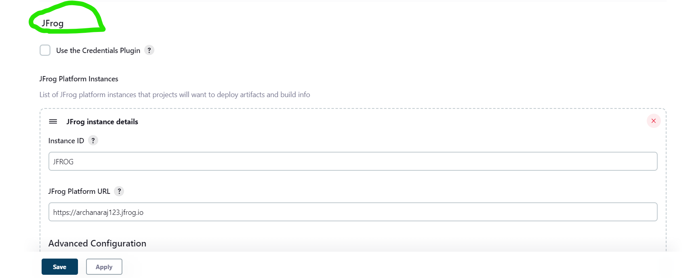
 * 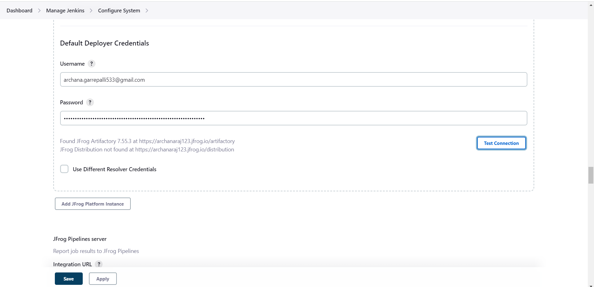
 * next goto instaces =>cd springpetclinic=>mvn 
 * next command -> mvn clean package
 * 
 * next we have to goto cd .m2
 * in that we have to create settings.xml file 
 * =>sudo vi settings.xml   =>in this we have to paste that jfrog 1st step file(what we have paste in notepad that code)
 * 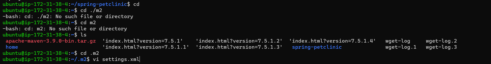
 * next command -> mvn clean install
 * 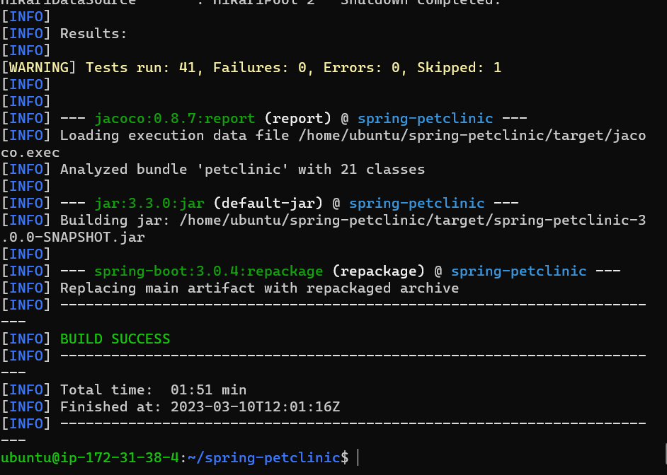
 * after that  deploy that distribution management code copy and paste in pom.xml above the <project> 
 * cat pom.xml
 * then we have to deploy
 * 
 * next command -> mvn deploy
 * 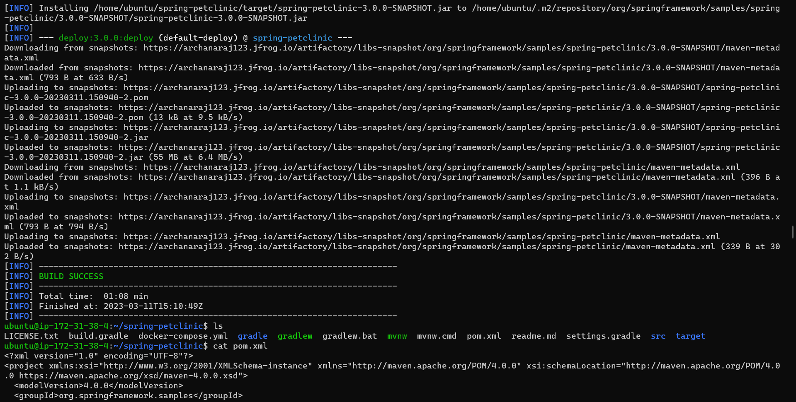
 * then goto jfrog page=>click on packages
 * 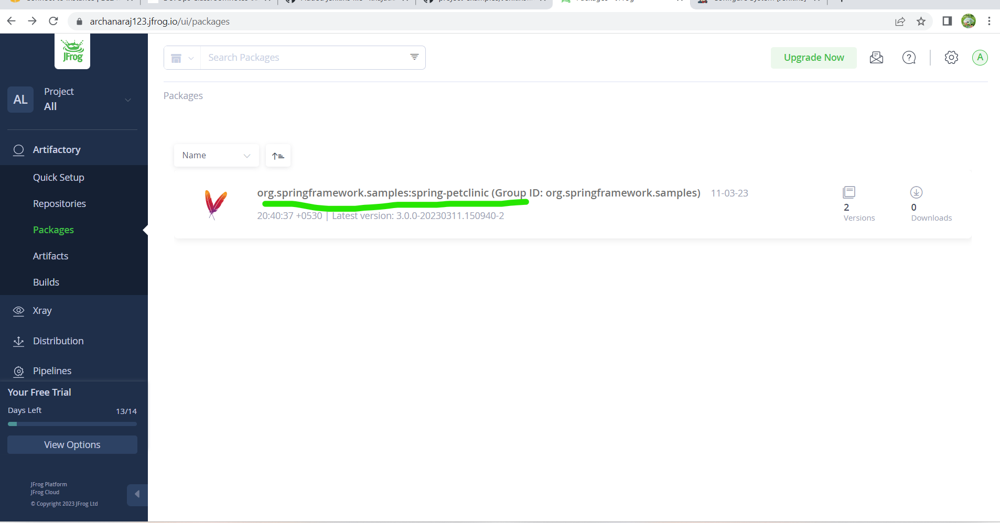
 * click on that project name org.spring...
 * 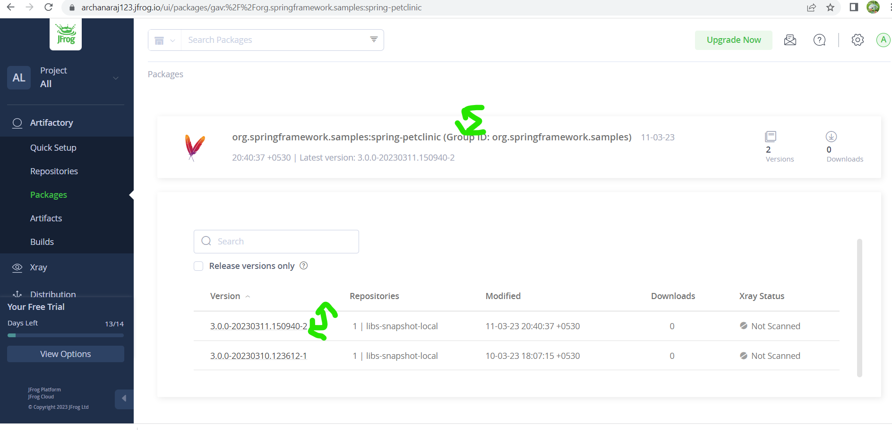
 * click on numder (libs-snapshot-local)
 * 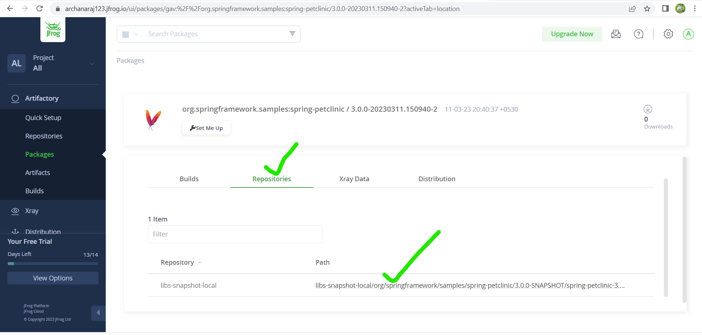
 * 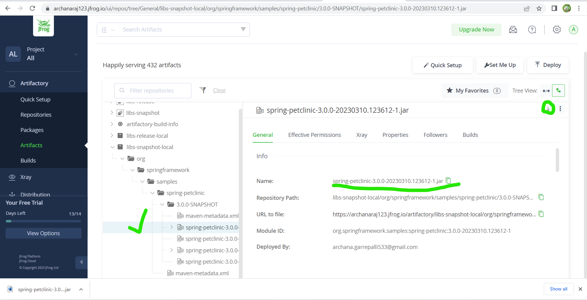
 * 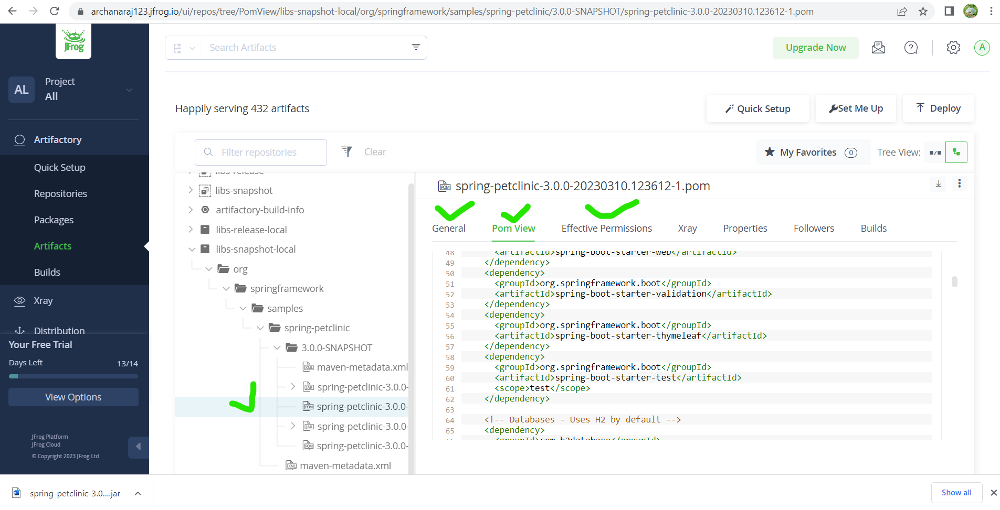
 * if we want jar file download it.
 * This all process form local repo to remote repo we have to do the add distribution management for mvn deploy
 * deploy means send to the remote repository and we have to push jar and pom files(if refresh that jfrog page then it maintains versions also 1.jar, 2.jar 1.pom,2.pom)
  
 