Excercise
-----------
# Create a Jenkins pipeline which deploys spring petclinic application into some linux machine
    Suggestions:
   * Run springboot as a linux daemon
   * Use git flow as branching strategy
   * Create a jenkins job for merging pull requests into develop branch
   * Fork the spring petclinic into your account
   * Have Jenkinsfile in your branches

## task
* Creating a pipeline for springpetclinic with 2 branches
* 1 branch is develop and 1 branch is release and next use with springboot(means create a service file) in release branch call ansible palybook
* In develop branch we can build the project and in the release branch we can deploy the project(deploy means it's ready to use the project) 
* copy and store the jar file in s3 bucket 
* required day build and night build in 1 branch day build in another branch night build is another branch
* Build in develop branch and deploy in release branch
* pull request into develop branch 
### prerequisites
1. First we can create 2 instances
   * In one node we can install java and jenkins i.e jenkins master node
   * jenkins commands:
       * curl -fsSL https://pkg.jenkins.io/debian-stable/jenkins.io.key | sudo tee \
  /usr/share/keyrings/jenkins-keyring.asc > /dev/null
       * echo deb [signed-by=/usr/share/keyrings/jenkins-keyring.asc] \
  https://pkg.jenkins.io/debian-stable binary/ | sudo tee \
  /etc/apt/sources.list.d/jenkins.list > /dev/null
       * sudo apt-get update
       * sudo apt-get install jenkins 
  * In another node we can install jdk 17, maven 3.9
  * commands:
        * sudo apt-get update
        * sudo apt install openjdk-17-jdk
        * wget https://dlcdn.apache.org/maven/maven-3/3.9.0/binaries/apache-maven-3.9.0-bin.tar.gz
        * (goto maven web page download->3.9.binary right click copy link address)
        * next ls then untar the (tar xzvf apache-maven...)
        * ls
        * sudo mv apache-maven.... /opt/maven
        * sudo vi /etc/environment(path give in environmental variable)
        * source /etc/environment
        * give maven path :/opt/maven/bin/mvn
  * Next connect this node to jenkins means got to jenkins master node ->mange jenkins->mange nodes-> for configure see below images
  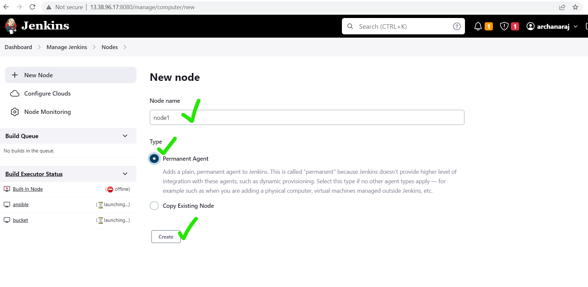
  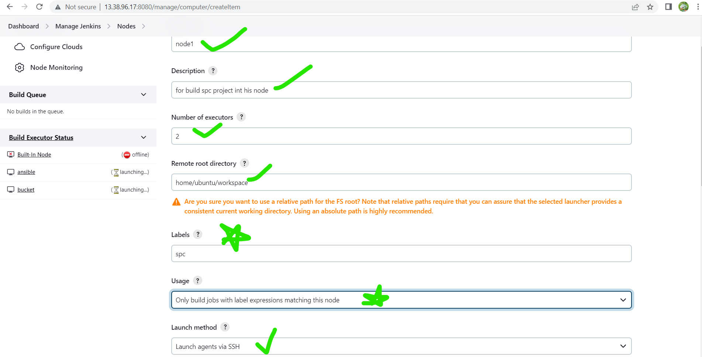
  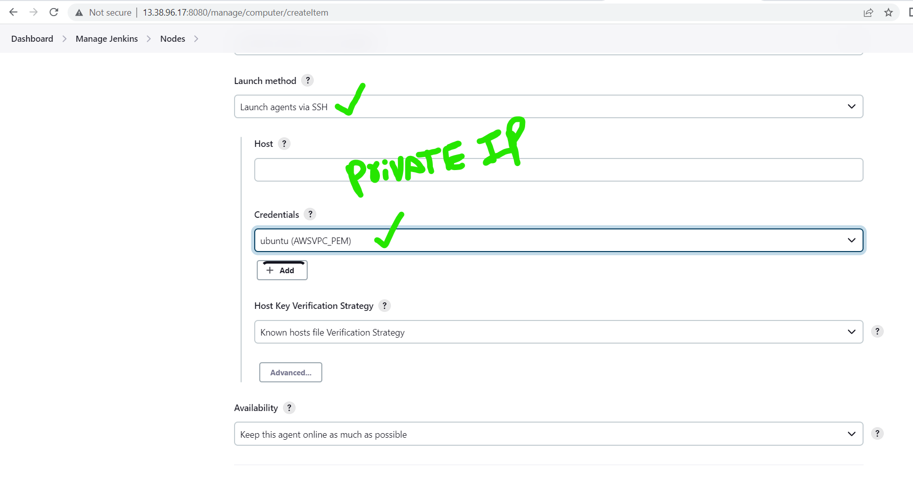
  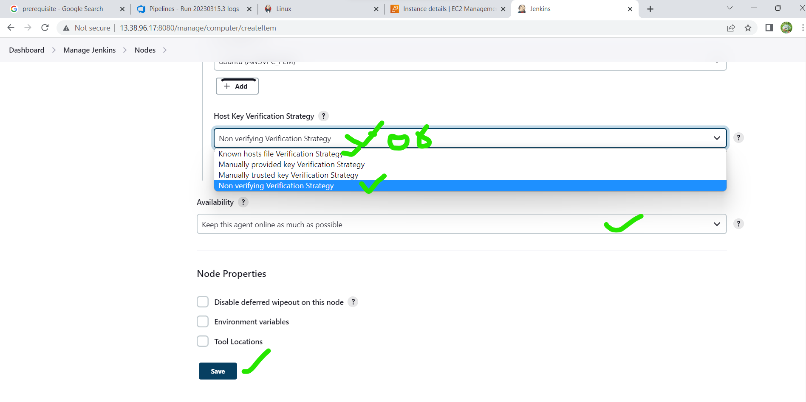
``

2. Goto our local repo(local repo means what we cloned in my laptop i.e local repo)
   
   * create a folder example i can create a folder jenkins in that i can create another folder spring go to that path in terminal with the help of 'cd' command cd ..->cd ..->cd jenkins->cd spring->git clone url(what we want the project url take from github)
   * next command cd dummyspring
   * git branch
   * in the main branch we didn't do any changes
   * now i can create another branch with help of this command
   * git checkout -b <branch name>
   * git checkout -b develop
   * next 'code .'
   * goto vsc(visual studio coce)
   * create a file with the name 'Jenkinsfile'
   * in that write a pipeline
  [Preview](./jenkinsimages/jn5.png)

## for creating the jenkins pipeline in develop branch we need below stages
  -------
In the develop branch we can build the project 
  * vcs(version controlsystem)==>Version control systems are software tools that help software teams manage changes to source code over time. As development environments have accelerated, version control systems help software teams work faster and smarter.(EX-github is a vcs)
  * build -for maven to build(in develop branch)
  * archive & junit results to -archieve the artifacts & publish junit test results==>(Archive of the artifacts in Jenkins is a feature that allows us to store the output files after we build the project with Jenkins. For example, you have an application project that uses Apache Maven to build. Normally we will use the “mvn clean install” command to build the Apache Maven application. If you notice, with this build statement, each running, the result of the previous build will be deleted. We cannot get old output files. Using Jenkins’s Archive the artifacts feature can help us solve this problem.)
  * sonar qube analysis -it is a static code analysis
    [Refer here](https://www.opensourceforu.com/2021/08/static-code-analysis-using-sonarqube-and-jenkins/) if we want to add sonarqube int this add this below steps

    ```
    stage('sonar analysis') {
            steps {
                // performing sonarqube analysis with "withSonarQubeENV(<Name of Server configured in Jenkins>)"
                withSonarQubeEnv('sonar') {
                    sh ' /opt/maven/bin/mvn verify sonar:sonar -Dsonar.login=dd2ae8429ff2329725487f005646a76ef352ef2d -Dsonar.host.url=https://sonarcloud.io -Dsonar.organization=archanaraj-m -Dsonar.projectKey=archanaraj-m'
                }
            }
        }

    ```    
  * (An integrated development environment (IDE) is a software application that helps programmers develop software code efficiently.)
  * copy the build to in any storage sources(example:s3 bucket)


```

pipeline {
    agent { label 'ansible' }
    triggers { pollSCM ('30 9 * 3 *') }
    stages {
        stage('vcs') {
            steps {
                git url: 'https://github.com/archanaraj-m/dummyspring.git',
                    branch: 'develop'
            }
        }
        stage('build') {
            tools {
                jdk 'JDK_17_UBUNTU'
            }
            steps {
                sh "/opt/maven/bin/mvn package"
            }
        }
        stage('archieve artifactory') {
            steps {
                archiveArtifacts artifacts: '**/spring-petclinic-3.0.0-SNAPSHOT.jar'
                junit testResults: '**/*.xml'
            }
        }        
        stage('copy to s3 bucket') {
            steps {
                sh "mkdir -p /tmp/${JOB_NAME}/${BUILD_ID}"
                sh "cp -r **/spring-petclinic-3.0.0-SNAPSHOT.jar /tmp/${JOB_NAME}/${BUILD_ID}"
                sh "aws s3 sync /tmp/${JOB_NAME}/${BUILD_ID} s3://devbucket9 --acl public-read-write"
            }
        }
    }
}    


```

* Next goto jenkins dashboard => declarative view => click on New Item=> spc-dev =>pipeline =>ok
  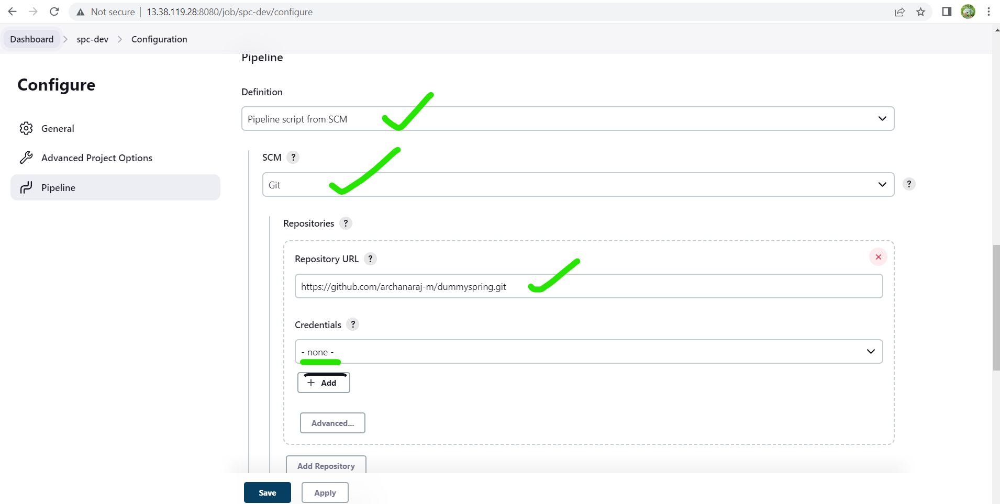
  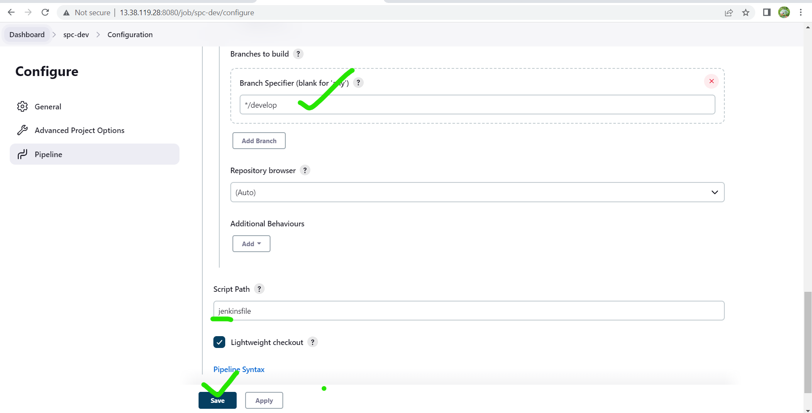
  before that configure the node in manage jenkins=>manage node=>see above previews2,3,4
* build the pipeline
* 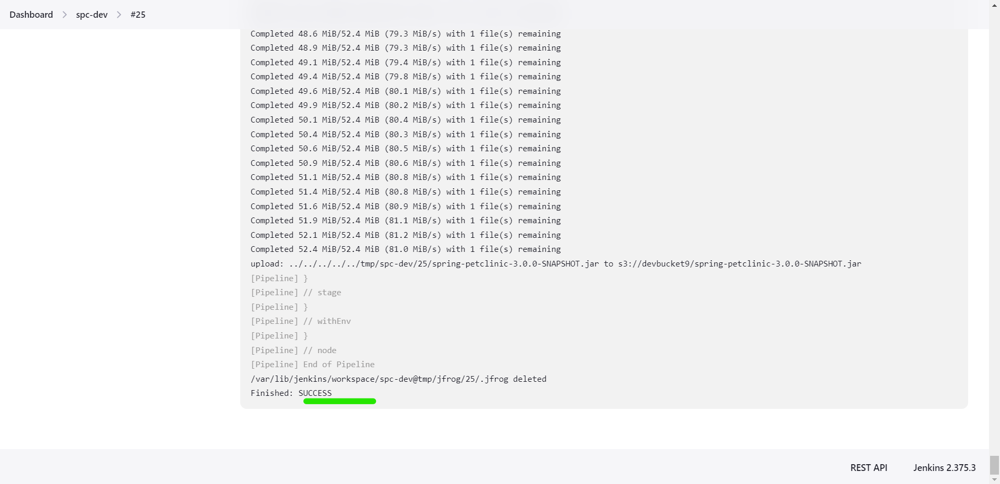


## for creating the jenkins pipeline in relese branch we need below stages
=>jenkins node(spc-release)
* For this purpose we need shh=keygen and copy the id to lovan host
  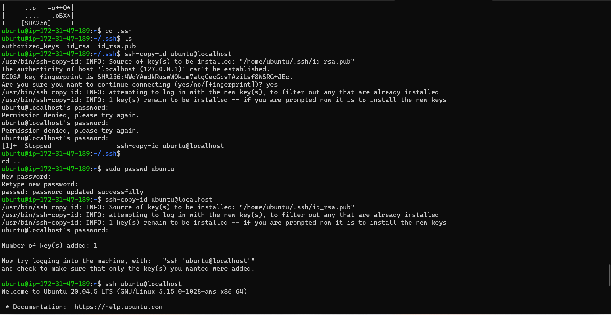 and 
  ```
  sudo vi hosts
  
  ```
  in this write localhost

* vcs
* build- for maven build(if mvn error came mentioned in that mvn path also)
  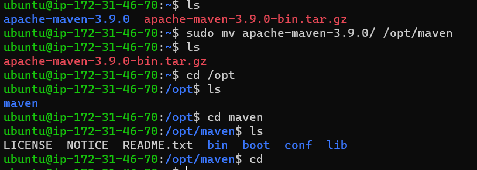
  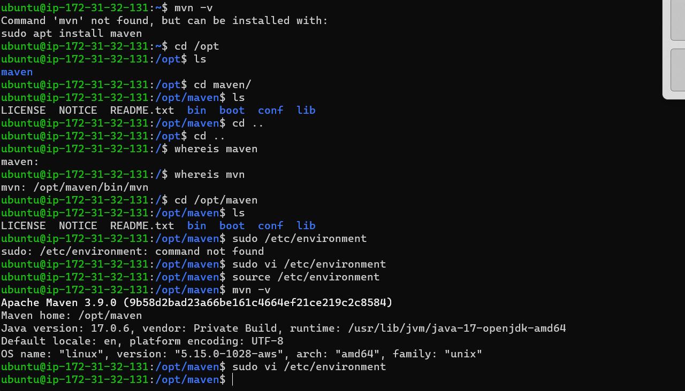
  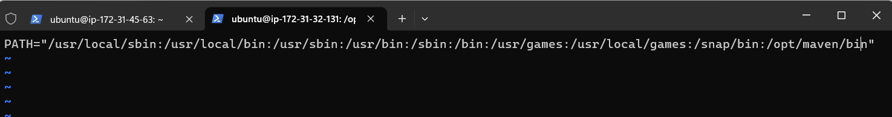
* Archive artifactory-publish junit test results
* copy the build files(.jar) in any storage sources(example:s3 bucket)
* first we can create a bucket in AWS=>s3 bucket=>create a bucket=>see the preview's
  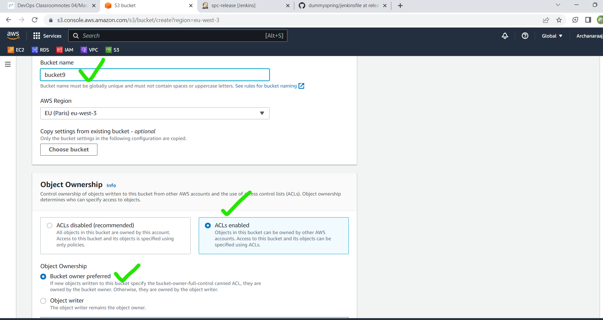
  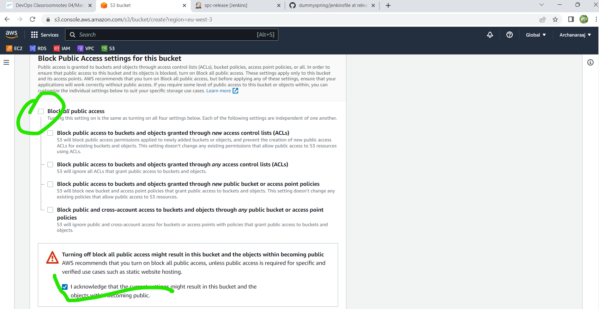
  same as it is don't change in that bucket page
  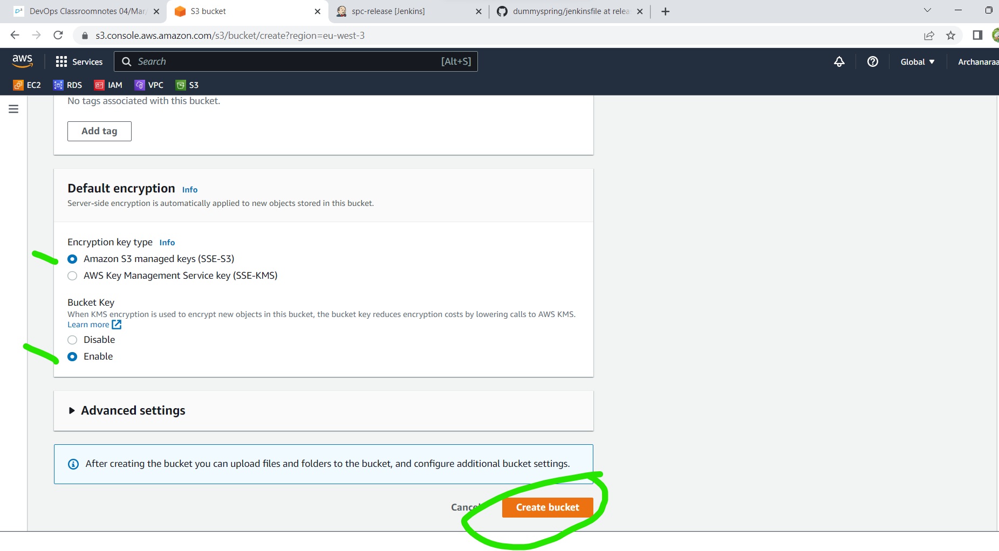
* Actually for copy the jar files in s3 bucket normal purpose we don't need ACL'spermission=>ACL's disabled  and give public access permissions but for depolymenyt purpose we need ACL's permission
  for that block public access and give ACL's permissions 
* After download the jar file in s3 bucket we can click on the bucket and select and copy url paste it in ansible playbook
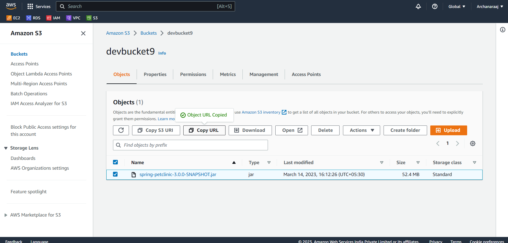 
* After that we can goto our local repo and create release branch 
 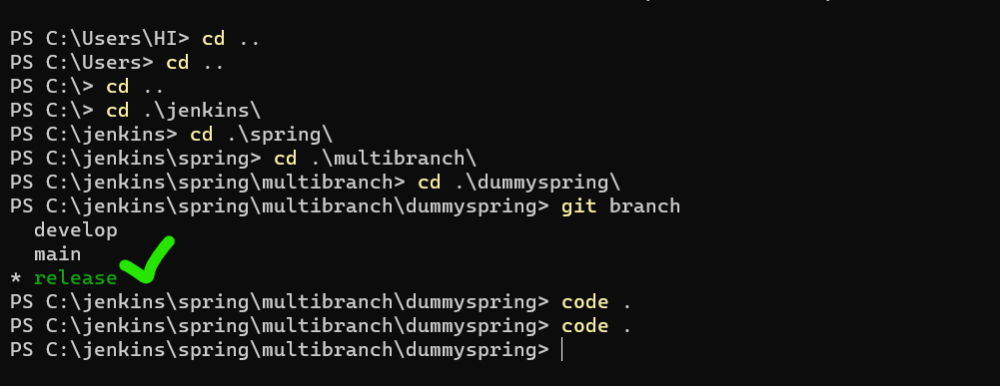
 for creating the branch 'git checkout -b release'
* Then create a pipeline and in that spc files we can add service file and add spc ansible playbook.yml file also
* Actually the service file required for springboot 
* we can use ansible for deploy the project in this branch for that we need ansible-playbook and spc service file
  
```

pipeline {
    agent { label 'ansible' }
    triggers { pollSCM ('30 0 * 3 *') }
    stages {
        stage('vcs') {
            steps {
                git url: 'https://github.com/archanaraj-m/dummyspring.git',
                    branch: 'release'
            }
        }
        stage('build') {
            tools {
                jdk 'JDK_17_UBUNTU'
            }
            steps {
                sh "/opt/maven/bin/mvn package"
            }
        }
        stage('archieve artifactory') {
            steps {
                archiveArtifacts artifacts: '**/spring-petclinic-3.0.0-SNAPSHOT.jar'
                junit testResults: '**/*.xml'
            }
        }        
        stage('copy to s3 bucket') {
            steps {
                sh "mkdir -p /tmp/${JOB_NAME}/${BUILD_ID}"
                sh "cp -r **/spring-petclinic-3.0.0-SNAPSHOT.jar /tmp/${JOB_NAME}/${BUILD_ID}"
                sh "aws s3 sync /tmp/${JOB_NAME}/${BUILD_ID} s3://devbucket9 --acl public-read-write"
            }
        }
        stage('deploy in ansible') {
            steps {
                sh "ansible-playbook -i hosts ./springpetclinc.yml"
           }        
        }    
    }
}    

```
* The service file is

```
[Unit]
Description=springpetclinic service

[Service]
Environment="JAVA_HOME=/usr/lib/jvm/java-17-openjdk-amd64"
WorkingDirectory=/home/ubuntu
Type=simple
ExecStart=java -jar spring-petclinic-3.0.0-SNAPSHOT.jar
Restart=on-failure
RestartSec=15

[Install]
WantedBy=multi-user.target


```

spc ansible-palybook

```
---
- name: download spc jar file
  hosts: all
  become: yes
  tasks:
    - name: install spc
      get_url:
        url: https://devbucket9.s3.eu-west-3.amazonaws.com/spring-petclinic-3.0.0-SNAPSHOT.jar
        dest: /home/ubuntu
    - name: copy the service file
      copy:
        src: spc.service
        dest: /etc/systemd/system/spc.service
        mode: "777"
    - name: daemon reload
      systemd:
        name: spc.service
        daemon_reload: yes
        state: started
        enabled: yes

```

* After success the project  we can copy the publicIP of node and paste in newtab
  then spc page came<publicIP:8080>
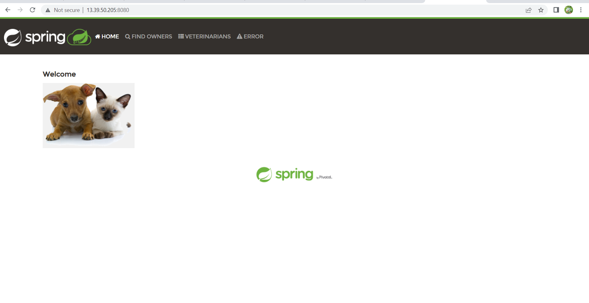
* If any error came check the status of service file once
  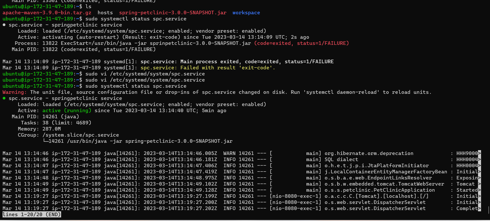
 


  


