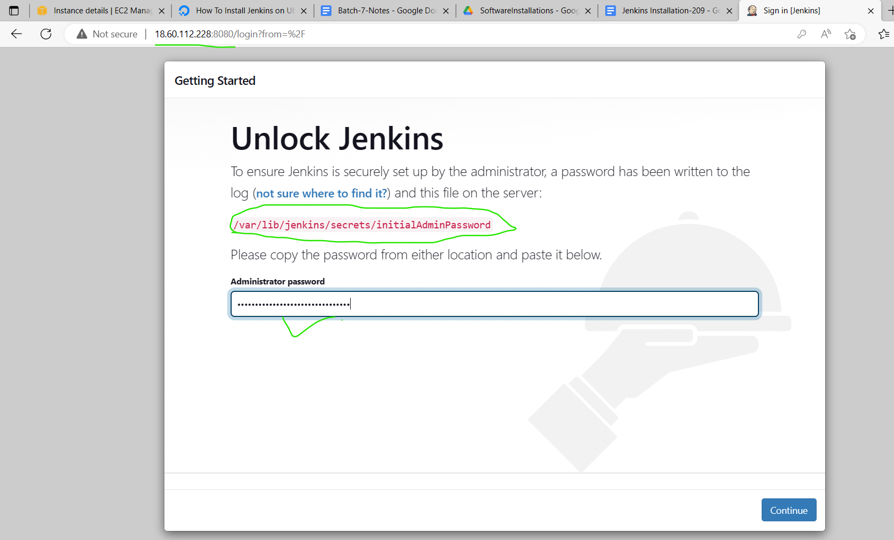

jenkins conection b/w 2 nodes.
------------------------------ 
# steps

* First we can create two instances with .pem(private key) key don't use import key. and security group selected port all.
* Next connect that instances in powershell
* For jenkins we needed java so we can install java in 2 nodes
```
In jenkins master node
sudo apt-get update
sudo apt-get install openjdk-17-jdk -y
curl -fsSL https://pkg.jenkins.io/debian-stable/jenkins.io.key | sudo tee \
  /usr/share/keyrings/jenkins-keyring.asc > /dev/null
echo deb [signed-by=/usr/share/keyrings/jenkins-keyring.asc] \
  https://pkg.jenkins.io/debian-stable binary/ | sudo tee \
  /etc/apt/sources.list.d/jenkins.list > /dev/null
sudo apt-get update
sudo apt-get install  jenkins -y
```
* After installing jenkins in master node a user created with jenkins(username) in  /var/lib/jenkins

* After installing jenkins in master node copy the master node IP address and paste it in newtab with :8080
* After jenkins page opened that "var/lib..../passwd" copy and paste in powershell with cat command for password like see preview jen1.png
* password paste in that box cliclk on continue

* we can give user name and pass wd
then goto jenkins page click on install  suggsted pilugins  see the pages  


refer here [direct devops blog](https://directdevops.blog/2023/02/26/devops-classroomnotes-26-feb-2023/)

next in another node also install any java version mandatory,no need jenkins only install java


